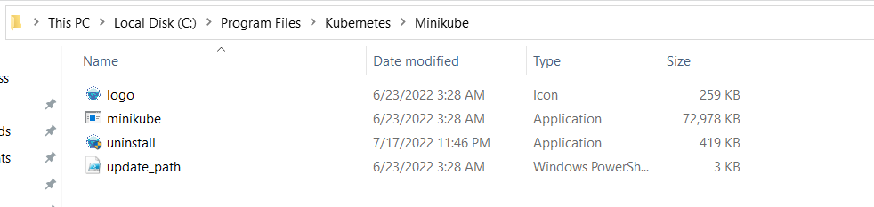
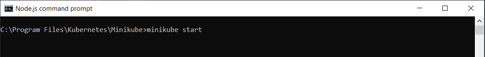
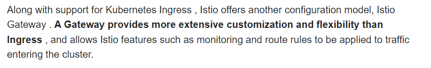
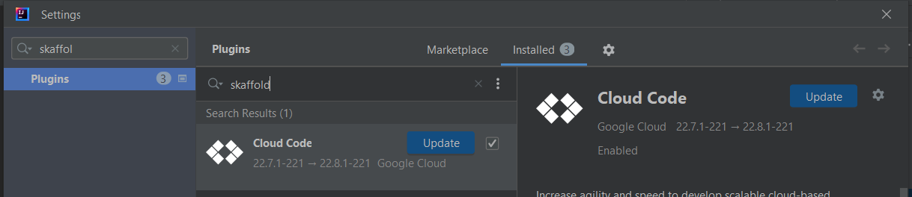
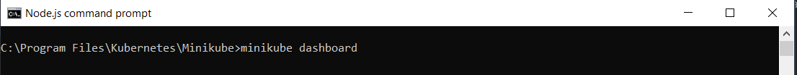
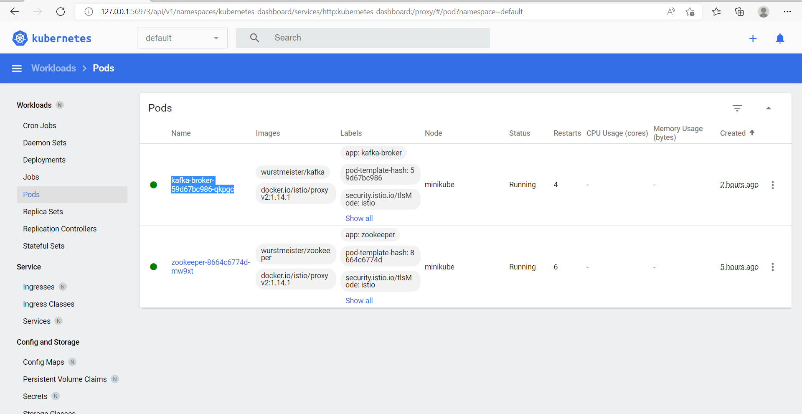
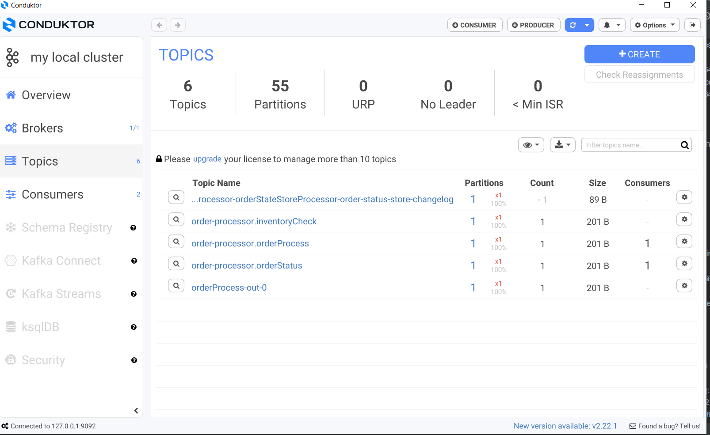

# REAL TIME ORDER PROBLEM SOLVING USING KAKKA STREAMS

Flow chat for this example is given below.

## Pre-requisites
- docker
- minikube

## Kubernetes (k8s)
- To run kubernetes locally ,for this example we are using minikube
- Download minikube using below link 
- https://minikube.sigs.k8s.io/docs/start/
- Commonly used minikube commands:
- minikube start
- minikube dashboard
- minikube service list

#### Installation directory:

#### Command line

## ISTIO 
- For this example we are using **Istio**. 
- It acts as a proxy like zuul
- It also provides ingress features (Ingress is used to expose services to outside world)

  
## Skaffold

- skaffold is google plugin to manage k8s deployment files
- It combines all k8s files and execute them at once
- Ref to skaffold.yml
- Here are some useful skaffold commands:
- skaffold build -f skaffold.yaml
- skaffold init --skip-build
- skaffold dev --port-forward -n test

## Commonly Used k8s Commands

- kubectl get pods
- kubectl delete pod {name}
- kubectl logs -f {pod name}
- kubectl delete service/product-catalog
- kubectl apply -f deployment.yml
- kubectl get service
- kubectl get endpoints
- kubectl cluster-info
- kubectl explain deployment
- kubectl explain deployment.spec.replicas
- kubectl explain service
- kubectl explain service.spec.type
- kubectl get pods --watch         // watch your Pods coming alive
- kubectl get nodes
- kubectl config view
- kubectl get namespaces
- kubectl get services -n kafka  -----get services of particular namespace
- kubectl port-forward kafka-broker-566d4c5644-rxkn9 9092 -n kafka        // port forward with namespace
- kubectl port-forward kafka-broker-566d4c5644-rxkn9 9092                 // port forward without namespace
- kubectl get deployments -n kafka
- kubectl expose deployment order-service --type=LoadBalancer --name=order-service -n kafka
- kubectl describe service kafka
- minikube service kafka-service
- kubectl config get-contexts
- kubectl create ns {namespace}

## Key Notes
- For this project all microservices and kafka instance are running over k8s cluster(minikube)
- Kafka instance is preferred to setups manually using the commands given below:
- It prevents the kafka instance to restart or get down with microservices when use skaffold.
- kubeclt apply -f 01-zookeeper.yml
- kubeclt apply -f 02-kafka.yml
- kubeclt apply -f istio.yml
- Once kafka is up, you can access it through kafka-service:9092 internally.
- And for external access use port-forwarding:
- kubectl port-forward {kafka-pod-name} 9092
- After this command now you can access kafka using localhost:9092 externally.
#### Minikube dashboard  

#### Conduktor

### Client Service
Client service is mainly responsible to directly reading data from Kafka store(kTable) using  **InteractiveQueryService**.                            
It can also reday data from any topic as well using consumer as describe in OrderConsumer.class

### Delivery Service
Delivery Service is mainly consumes data from delivery topic and apply delivery related business rules

### Inventory Service
Inventory Service is also consumes data from inventory topic and apply inventory related business rules

### Processor Service
Mainly responsible for filtering and forwarding order stream to related topics

    @Bean
    fun orderProcess(): Function<KStream<String, OrderDto>,KStream<String, OrderDto>> {
        return Function<KStream<String, OrderDto>,KStream<String, OrderDto>> { kStream ->

            logger.log(Level.INFO,"Stream of orders received for inventory checking $kStream");
            kStream
                .peek{orderId,order -> logger.log(Level.INFO,"Routing OrderDto $orderId  ${order.orderStatus}") }
                .split()
                .branch(orderTopology.inventoryCheckPredicate, Branched.withConsumer{ks->ks.to(inventoryCheckTopic)})
                .branch(orderTopology.shippingPredicate, Branched.withConsumer{ks->ks.to(deliveryCheckTopic)})
                .branch(orderTopology.unFulfilledOrderPredicate, Branched.withConsumer{ks->ks.to(unFulfilledOrderTopicName)})

            kStream

        }

## FLOW DIAGRAM

